# RIGStats (rig-dashboard)

- A gaming stats dashboard optimized for a vertical secondary display (450×1920).

- Shows CPU, GPU, RAM, network, disk, and NVMe/SSD temperatures in real time.

- Computer name, CPU model, and GPU model are detected automatically at startup.

## Overview

RIGStats is a Windows desktop dashboard built with Tauri v2. It targets a vertical secondary display and shows live CPU, GPU, RAM, network, and disk data.

## Screens

### Main Dashboard

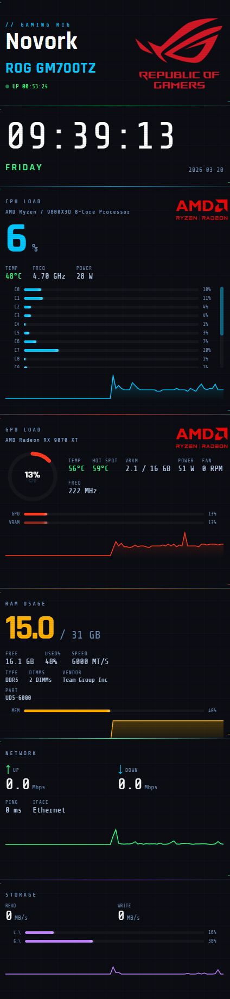

The main dashboard is designed for a vertical secondary display and keeps the live system view visible at a glance.

It shows:

- CPU load, clocks, temperature and power
- GPU load, temperature, hotspot, clocks, VRAM and fan data
- RAM usage and installed memory details
- Network throughput and ping
- Disk activity, drive usage, and NVMe/SSD temperatures

From here you can:

- monitor the machine continuously on a portrait side display
- keep the app hidden to the tray when not needed
- open the tray menu for `Settings`, `Status`, `About`, and `Updates & Changelog`

### Status Dialog

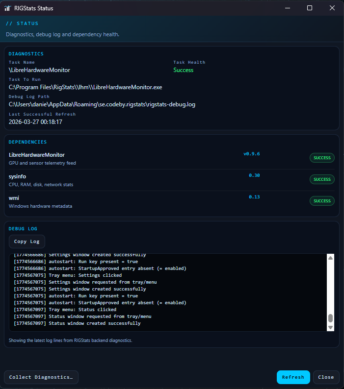

The Status dialog is the diagnostics view for runtime health and backend troubleshooting.

It shows:

- scheduled task information for LibreHardwareMonitor
- dependency health for LibreHardwareMonitor, `sysinfo`, and `wmi`
- the current debug log path
- the latest debug log output
- the timestamp for the last successful refresh

From here you can:

- confirm that sensor dependencies are healthy
- inspect startup/runtime issues without opening external tools
- copy the visible debug log for troubleshooting
- refresh diagnostics on demand while the log also auto-updates in the dialog
- export a diagnostics ZIP bundle for bug reports (see [Diagnostics Export](#diagnostics-export))

### About Dialog

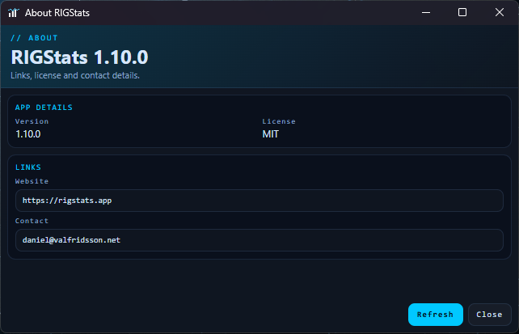

The About dialog is the lightweight product-information view.

It shows:

- the current RIGStats version
- the project license name
- direct links to the website and contact

From here you can:

- quickly verify which build/version is running
- open rigstats.app in the default browser
- contact the maintainer directly

### Updates & Changelog Dialog

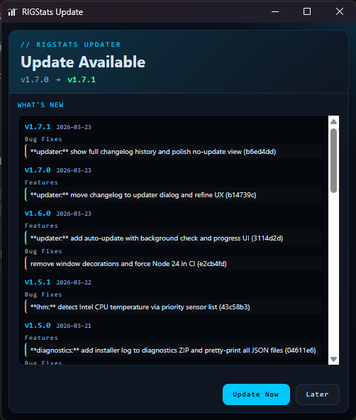

The Updates & Changelog dialog handles update discovery and version history.

It shows:

- available update version alongside the current version (when an update exists)
- release notes for the new version sourced from GitHub (`latest.json`)
- full local version history (bundled CHANGELOG.md) below the new version's notes
- download and installation progress bar

From here you can:

- install the latest version with one click
- track download progress while the update is fetched
- browse the complete release history with clickable links to GitHub diffs

### Settings Dialog

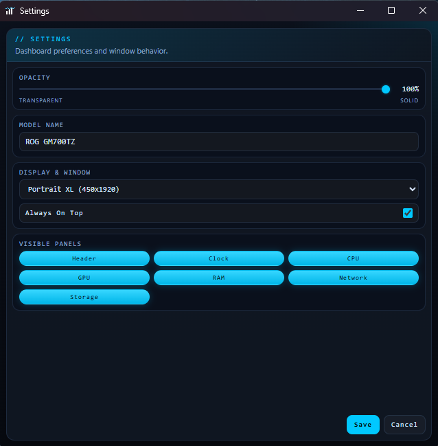

The Settings dialog controls the dashboard presentation and placement behavior.

It shows:

- opacity slider for transparency control
- editable model name
- display profile selector
- always-on-top toggle

From here you can:

- change the dashboard profile for different portrait displays
- adjust transparency live before saving
- override the displayed model name
- control whether the main dashboard stays on top

## Hardware Support

Data comes from two parallel sources that are merged each refresh cycle:
**LibreHardwareMonitor v0.9.6** (sensor telemetry via local HTTP) and **sysinfo** (OS-level counters).
WMI provides static metadata at startup.

### CPU

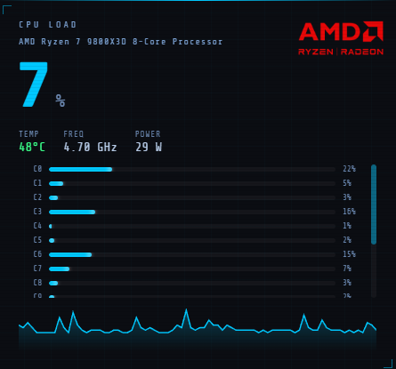

| Metric | Source |
| --- | --- |
| Total load (%) | sysinfo |
| Per-core load (%) | sysinfo |
| Clock frequency (GHz) | sysinfo |
| Package temperature (°C) | LHM — AMD: `Core (Tctl/Tdie)` |
| Package power (W) | LHM — `Package` power sensor |

> CPU temperature currently uses the AMD sensor label `Core (Tctl/Tdie)`.
> Intel CPUs report temperature in LHM under a different sensor name; no value will appear in the temp field on Intel systems until that mapping is added to `src-tauri/src/lhm.rs`.

### GPU

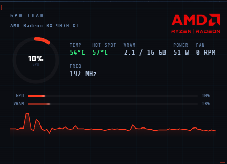

| Metric | Source |
| --- | --- |
| Core load (%) | LHM — `GPU Core` load |
| Core temperature (°C) | LHM — `GPU Core` temperature |
| Hot spot temperature (°C) | LHM — `GPU Hot Spot` temperature |
| Core clock (MHz) | LHM — `GPU Core` clock |
| Package power (W) | LHM — `GPU Package` power |
| Fan speed (RPM) | LHM — `GPU Fan` |
| VRAM used / total (GB) | LHM — `GPU Memory Used` / `GPU Memory Total` |

Supports NVIDIA and AMD discrete GPUs through LHM.
Intel Arc GPUs should work but have not been tested.

### RAM

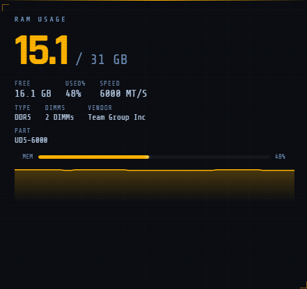

| Metric | Source |
| --- | --- |
| Used / free / total (GB) | sysinfo |
| Memory type (DDR–DDR5) | WMI `Win32_PhysicalMemory.SMBIOSMemoryType` |
| Speed (MHz) | WMI `Win32_PhysicalMemory.ConfiguredClockSpeed` / `Speed` |
| Manufacturer & part number | WMI `Win32_PhysicalMemory` |

### Storage

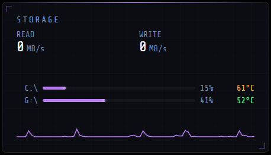

| Metric | Source |
| --- | --- |
| Read throughput (MB/s) | LHM — aggregated across up to 2 drives |
| Write throughput (MB/s) | LHM — aggregated across up to 2 drives |
| Per-drive capacity and usage | sysinfo |
| Filesystem label | sysinfo |
| Drive temperature (°C) | LHM — highest real temperature sensor per drive (`/nvme/`, `/hdd/`, `/ata/`, `/scsi/`), matched to drive letter via WMI at startup |

### Network

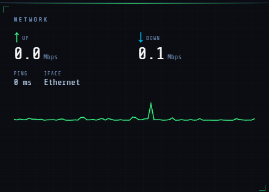

| Metric | Source |
| --- | --- |
| Upload speed (Mbps) | LHM — best active interface |
| Download speed (Mbps) | LHM — best active interface |
| Active interface name | sysinfo |
| Latency / ping (ms) | Windows `ping` command — default gateway, falls back to `1.1.1.1` |

### Clock

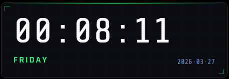

| Metric | Source |
| --- | --- |
| Time | sysinfo |
| Day | sysinfo |
| Date | sysinfo |

### System Identity

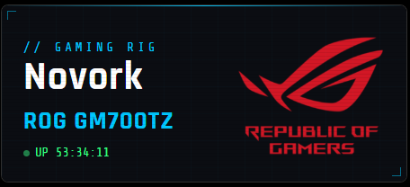

| Metadata | Source |
| --- | --- |
| Computer / rig name | `hostname` crate |
| CPU model string | sysinfo |
| GPU model string | WMI `Win32_VideoController`, falls back to LHM tree |
| System brand / logo | WMI `Win32_ComputerSystem`, `Win32_ComputerSystemProduct`, `Win32_BaseBoard` |

### Recognized System Brands

The header logo follows a three-step fallback chain:

1. **Brand logo** — if the system matches a known gaming/OEM brand below.
2. **CPU architecture logo** — Intel or AMD, derived from the CPU model string.
3. **Nothing** — the logo area is hidden silently.

#### Brand logos

Brand is detected from WMI fields `Win32_ComputerSystem.Manufacturer`, `Win32_ComputerSystem.Model`,
`Win32_ComputerSystemProduct.Name/Version`, and `Win32_BaseBoard.Manufacturer/Product`.
Product-line names (Alienware, Legion, OMEN, Predator, AORUS) take priority over generic OEM names.

| Logo | Brand | Detected when |
| --- | --- | --- |
|  | **ROG (ASUS)** | Manufacturer contains `ASUS`, `ROG`, or `Republic of Gamers` |
|  | **MSI** | Manufacturer contains `MSI`, `Micro-Star`, or `Micro Star` |
|  | **Alienware** | System name / model contains `Alienware` |
|  | **Razer** | Manufacturer contains `Razer` |
|  | **Lenovo Legion** | System name / model contains `Legion` |
|  | **HP OMEN** | System name / model contains `OMEN` |
|  | **Acer Predator** | System name / model contains `Predator` |
|  | **AORUS** | System name / model contains `AORUS` |
|  | **Gigabyte** | Manufacturer contains `Gigabyte` |

#### CPU architecture fallback logos

If no brand logo matches, the detected CPU model string is used to show an architecture badge instead.

| Logo | Architecture | Detected when |
| --- | --- | --- |
|  | **Intel** | CPU model contains `Intel`, `Core i`, `Xeon`, or `Arc` |
| 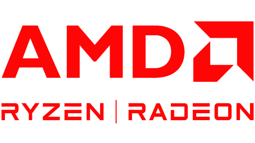 | **AMD** | CPU model contains `AMD`, `Ryzen`, `Athlon`, or `EPYC` |

Other recognized brands (ASRock, Corsair, NZXT, Dell, Lenovo, HP, Acer) fall through to the CPU
architecture fallback. Fully unknown systems show nothing.

---

## Diagnostics Export

The Status dialog has a **Collect Diagnostics…** button. Clicking it opens a native Windows save dialog and writes a single ZIP file that captures everything needed to investigate hardware compatibility issues, missing sensor support, or unexpected behaviour.

### What Is Collected

| File in ZIP | Contents | Why it is needed |
| --- | --- | --- |
| `manifest.json` | Collection timestamp (Unix seconds), RIGStats version | Ties the report to a specific build |
| `debug.log` | Full RIGStats debug log from disk | Startup sequence, LHM connectivity, error events |
| `settings.json` | Persisted user settings (opacity, profile, model name) | Rules out configuration-specific issues |
| `lhm-data.json` | Raw LHM sensor tree from `localhost:8085/data.json` | **Most important file for adding sensor support** — shows all sensor names and values as LHM reports them on the actual machine |
| `hardware.json` | WMI/CIM snapshot: OS version, CPU (name, cores, max clock), GPU (name, VRAM, driver), motherboard (manufacturer, model, product, base board), RAM (capacity per stick, speed, type code, manufacturer, part number) | Hardware identification and brand detection |
| `sched-task.txt` | Raw output of `schtasks /Query /V` for both LHM task names | Diagnose LHM autostart failures |
| `environment.txt` | `PROCESSOR_ARCHITECTURE`, `COMPUTERNAME`, Windows build and display version | OS-level context for platform-specific bugs |
| `sysinfo.json` | sysinfo snapshot: CPU brand, core count, memory totals, disk mount points, network interface names, detected RAM spec, ping target | Verify what `sysinfo` sees on the machine |
| `displays.json` | All connected monitors: name, resolution, position, scale factor, portrait/landscape, fit score for the active profile, and which monitor was selected | Diagnose window placement and wrong-monitor issues |

### What Is Not Collected

- No file paths outside the RIGStats data directory
- No browser history, tokens, or credentials of any kind
- No data is transmitted anywhere — the ZIP is written only to the location you choose
- No telemetry is sent automatically at any time

The ZIP is purely a local file that you choose whether to share.

---

## Stack

| Component | Role |
| --- | --- |
| **Tauri v2** | App framework (native window, IPC, system tray, auto-update) |
| **Rust / sysinfo** | CPU, RAM, disk, network data |
| **LibreHardwareMonitor** | GPU/CPU sensors, disk/network throughput |
| **HTML / CSS / JS** | Dashboard UI (renderer) |

---

## Quick Start

1. Install dependencies:

   ```powershell
   npm install
   ```

2. Start development mode:

   ```powershell
   npm start
   ```

3. Build installer:

   ```powershell
   npm run build
   ```

  This downloads the pinned LibreHardwareMonitor bundle automatically if `vendor/lhm/` is missing.

## Documentation

- [Setup Guide](docs/setup.md)
- [Release And CI](docs/release.md)
- [Architecture](docs/architecture.md)
- [Troubleshooting](docs/troubleshooting.md)
- [Changelog](CHANGELOG.md)
- [Roadmap](ROADMAP.md)

## Notes

- Computer name, CPU model, and GPU model are detected automatically at startup
- Display sleep is not currently blocked by the app
- The app targets Windows 10/11 and Tauri v2

## License

This project is licensed under the MIT License.
See the LICENSE file for details.
