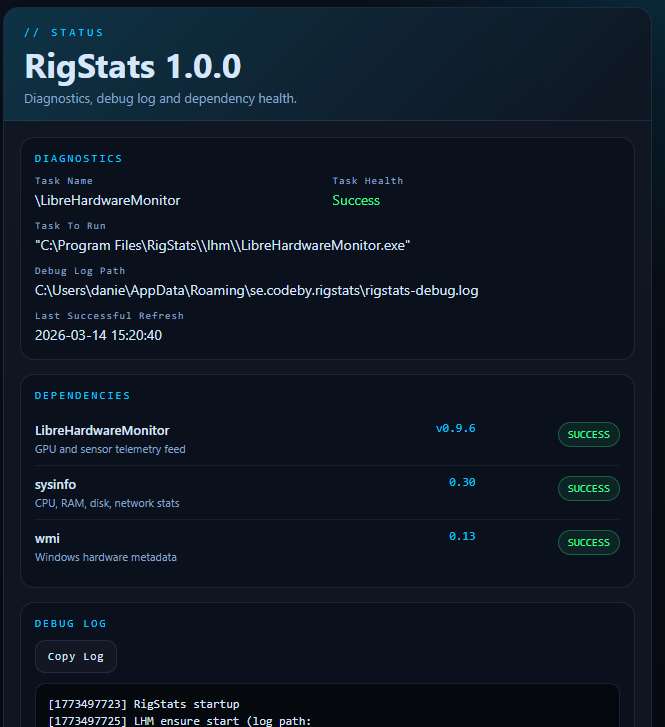
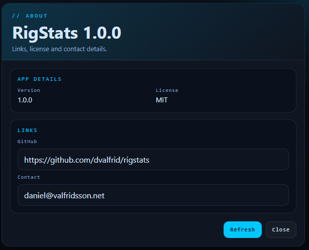
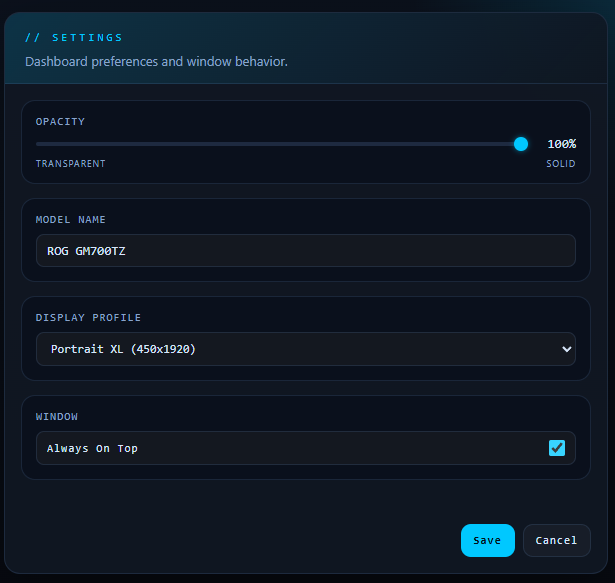

# RigStats (rig-dashboard)

- A gaming stats dashboard optimized for a vertical secondary display (450×1920).

- Shows CPU, GPU, RAM, network, and disk in real time.

- Computer name, CPU model, and GPU model are detected automatically at startup.

## Overview

RigStats is a Windows desktop dashboard built with Tauri v2. It targets a vertical secondary display and shows live CPU, GPU, RAM, network, and disk data.

## Screens

### Main Dashboard


The main dashboard is designed for a vertical secondary display and keeps the live system view visible at a glance.

It shows:

- CPU load, clocks, temperature and power
- GPU load, temperature, hotspot, clocks, VRAM and fan data
- RAM usage and installed memory details
- Network throughput and ping
- Disk activity and drive usage

From here you can:

- monitor the machine continuously on a portrait side display
- keep the app hidden to the tray when not needed
- open the tray menu for `Settings`, `Status`, and `About`

### Status Dialog



The Status dialog is the diagnostics view for runtime health and backend troubleshooting.

It shows:

- scheduled task information for LibreHardwareMonitor
- dependency health for LibreHardwareMonitor, `sysinfo`, and `wmi`
- the current debug log path
- the latest debug log output
- the timestamp for the last successful refresh

From here you can:

- confirm that sensor dependencies are healthy
- inspect startup/runtime issues without opening external tools
- copy the visible debug log for troubleshooting
- refresh diagnostics on demand while the log also auto-updates in the dialog

### About Dialog



The About dialog is the lightweight product-information view.

It shows:

- the current RigStats version
- the project license name
- direct links to GitHub and contact

From here you can:

- quickly verify which build/version is running
- open the repository page
- contact the maintainer directly

### Settings Dialog



The Settings dialog controls the dashboard presentation and placement behavior.

It shows:

- opacity slider for transparency control
- editable model name
- display profile selector
- always-on-top toggle

From here you can:

- change the dashboard profile for different portrait displays
- adjust transparency live before saving
- override the displayed model name
- control whether the main dashboard stays on top

## Stack

| Component | Role |
| --- | --- |
| **Tauri v2** | App framework (native window, IPC, system tray) |
| **Rust / sysinfo** | CPU, RAM, disk, network data |
| **LibreHardwareMonitor** | GPU/CPU sensors, disk/network throughput |
| **HTML / CSS / JS** | Dashboard UI (renderer) |

---

## Quick Start

1. Install dependencies:

   ```powershell
   npm install
   ```

2. Start development mode:

   ```powershell
   npm start
   ```

3. Build installer:

   ```powershell
   npm run build
   ```

  This downloads the pinned LibreHardwareMonitor bundle automatically if `vendor/lhm/` is missing.

## Documentation

- [Setup Guide](docs/setup.md)
- [Release And CI](docs/release.md)
- [Architecture](docs/architecture.md)
- [Troubleshooting](docs/troubleshooting.md)
- [Changelog](CHANGELOG.md)

## Notes

- Computer name, CPU model, and GPU model are detected automatically at startup
- Display sleep is not currently blocked by the app
- The app targets Windows 10/11 and Tauri v2

## License

This project is licensed under the MIT License.
See the LICENSE file for details.
