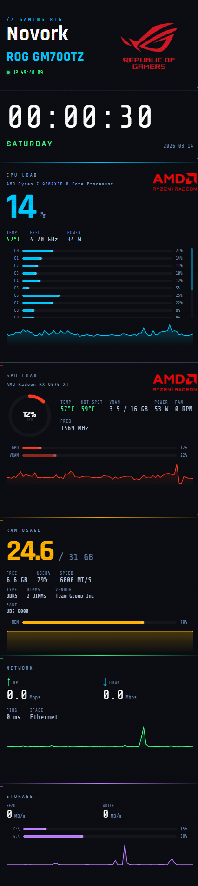

# RigStats (rig-dashboard)

<table>
  <tr>
    <td valign="top">
      <p>A gaming stats dashboard optimized for a vertical secondary display (450×1920).</p>
      <p>Shows CPU, GPU, RAM, network, and disk in real time.</p>
      <p>Computer name, CPU model, and GPU model are detected automatically at startup.</p>
      <p>Display sleep is not currently blocked by the app.</p>
    </td>
    <td valign="top" align="right">
      
    </td>
  </tr>
</table>

---

## Overview

RigStats is a Windows desktop dashboard built with Tauri v2. It targets a vertical secondary display and shows live CPU, GPU, RAM, network, and disk data.

## Stack

| Component | Role |
|---|---|
| **Tauri v2** | App framework (native window, IPC, system tray) |
| **Rust / sysinfo** | CPU, RAM, disk, network data |
| **LibreHardwareMonitor** | GPU/CPU sensors, disk/network throughput |
| **HTML / CSS / JS** | Dashboard UI (renderer) |

---

## Quick Start

1. Install dependencies:

   ```powershell
   npm install
   ```

2. Start development mode:

   ```powershell
   npm start
   ```

3. Build installers:

   ```powershell
   npm run build
   ```

  This downloads the pinned LibreHardwareMonitor bundle automatically if `vendor/lhm/` is missing.

## Documentation

- [Setup Guide](docs/setup.md)
- [Release And CI](docs/release.md)
- [Architecture](docs/architecture.md)
- [Troubleshooting](docs/troubleshooting.md)

## Notes

- Computer name, CPU model, and GPU model are detected automatically at startup
- Display sleep is not currently blocked by the app
- The app targets Windows 10/11 and Tauri v2

## License

This project is licensed under the MIT License.
See the LICENSE file for details.
