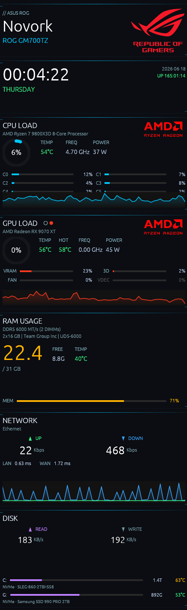
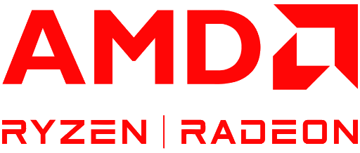

# RIGStats (rig-dashboard)

<div align="center">

[](https://github.com/dvalfrid/rigstats/releases/latest)
[](LICENSE)
[](https://github.com/dvalfrid/rigstats/releases/latest)
[](https://github.com/emilk/egui)

[](https://github.com/dvalfrid/rigstats/actions/workflows/verify.yml)
[](https://github.com/dvalfrid/rigstats/actions/workflows/build.yml)
[](https://github.com/dvalfrid/rigstats/actions/workflows/release.yml)

</div>

RIGStats is a Windows hardware-monitor dashboard built with egui — a native Rust UI targeting a vertical secondary display. For the full product overview, screenshots, and download, see [rigstats.app](https://rigstats.app).



## Installation

- **winget:** `winget install Codeby.RIGStats`
- **Direct download:** grab the latest installer from the [Releases page](https://github.com/dvalfrid/rigstats/releases/latest)

Both install the same signed NSIS installer, which also registers the sensor sidecar as a Windows Service. See [rigstats.app](https://rigstats.app/#download) for requirements and first-run guidance.

## Repository Layout

| Path | Contents |
| --- | --- |
| `src-egui/` | egui binary (`rigstats.exe`) — panels, tray, dialog windows |
| `rigstats-backend/` | Shared Rust lib — data sources, settings, hardware detection |
| `sensor-sidecar/` | .NET 10 C# Windows Service — LHM embedded, named-pipe server |
| `xtask/` | Cargo xtask — build, verify, fmt, clippy, test tasks |
| `docs/` | Architecture, setup, release, troubleshooting |
| `website/` | Product landing page source — not served at runtime |
| `build/` | NSIS installer script + signed PawnIO kernel driver |

## Prerequisites

- **Windows 10/11 x64** — the app and sensor sidecar are Windows-only
- **Rust stable** — install via [rustup.rs](https://rustup.rs)
- **.NET 10 SDK** — `winget install Microsoft.DotNet.SDK.10` (required for the sensor sidecar)
- **Visual Studio 2022 Build Tools** with "Desktop development with C++" workload (for linking)
- **NSIS** (installer builds only) — `choco install nsis -y`

> `cargo xtask verify` and `cargo xtask build` fail if the `rigstats-sensor` Windows Service is running because the service holds the exe open. Stop it first (`sc.exe stop rigstats-sensor` in an elevated terminal), then run the command, then restart the service.

## Quick Start

1. **Install git hooks** (run once after cloning):

   ```powershell
   cargo xtask setup
   ```

2. **Build and run** the debug binary:

   ```powershell
   cargo build --manifest-path src-egui/Cargo.toml
   .\target\debug\rigstats.exe
   ```

3. **Restart workflow** (Windows locks the exe while it runs):

   ```powershell
   Stop-Process -Id (Get-Process rigstats -ErrorAction Stop).Id -Force
   cargo build --manifest-path src-egui/Cargo.toml
   Start-Process .\target\debug\rigstats.exe
   ```

   Verify the exe timestamp changed before launching — if not, the process was still running.

4. **Production installer build**:

   ```powershell
   cargo xtask build
   ```

   The sensor sidecar exe is bundled automatically.

## Development

```powershell
# Format Rust (modifies files)
cargo xtask fmt

# Clippy — zero warnings required (-D warnings)
cargo xtask clippy

# Run Rust tests
cargo xtask test

# Full verify: sidecar build + tests + clippy + fmt-check
cargo xtask verify

# Build sensor sidecar only
dotnet build sensor-sidecar/sensor-sidecar.csproj

# Run a single Rust test
cargo test --manifest-path rigstats-backend/Cargo.toml classify_system_brand
```

> Stop `rigstats-sensor` before running `cargo xtask verify` or `cargo xtask build` — the service holds the exe open.

## Architecture

The sensor sidecar (`rigstats-sensor.exe`, .NET 10, LocalSystem Windows Service) embeds LibreHardwareMonitor and streams one JSON line per second over `\\.\pipe\rigstats-sensors`. The Rust backend reads that pipe alongside sysinfo (CPU/RAM/disk/network) and WMI (static hardware metadata at startup), then sends a `StatsPayload` to the egui UI thread each tick. The egui binary renders all panels and dialog windows natively — no WebView, no JavaScript at runtime.

See [docs/architecture.md](docs/architecture.md) for module-level detail and [docs/setup.md](docs/setup.md) for the full local development setup.

## Display & Placement

The dashboard renders on a secondary monitor and is configured entirely from
**Settings** (a 560×600 dialog with five tabs: Display, Panels, Alerts,
Appearance, General).

- **Display profiles** — pick a portrait or landscape profile that matches the
  target screen (e.g. `portrait-xl` = 450×1920, `landscape-xl` = 1920×450). The
  dashboard auto-targets the connected monitor whose resolution and orientation
  best match, and falls back to the primary monitor when none match. Switching
  profiles keeps the window where you left it as long as that spot is still
  on-screen.
- **Window layer** — `Normal`, `Always on Top`, `Always Behind`, or **Desktop
  Wallpaper**.
- **Floating mode** — render panels as individually draggable/lockable cards.
- **Fill Screen** — fill the height of the monitor the window currently sits on
  (panel proportions are preserved).

### Desktop Wallpaper (WorkerW) mode

Selecting **Window Layer → Desktop Wallpaper** renders the dashboard as a live
wallpaper, reparented into the desktop `WorkerW` layer between the wallpaper and
the desktop icons. It survives `Win+D`, is never covered by other windows, and
coexists with Wallpaper Engine / Lively.

Because the wallpaper is drawn by a separate background process
(`rigstats-wallpaper.exe`) that reads settings from disk, a few behaviours differ
from the normal layers and are **expected**:

- Settings apply on **Save**, not as a live preview (an amber banner reminds you).
- No-op controls grey out and the **Display Profile is locked** — switch back to a
  non-wallpaper layer to change the profile, then return and Save.
- **Window opacity has no effect** (a Win32 `WS_EX_LAYERED` limitation on WorkerW
  children).

See [docs/troubleshooting.md](docs/troubleshooting.md#desktop-wallpaper-mode) for
details.

## Sensor Coverage

Data is merged from three sources each tick: **LibreHardwareMonitor v0.9.6** (sensor telemetry via named pipe), **sysinfo** (OS-level counters), and **WMI** (static metadata at startup).

<!-- TODO: panels-collage.png — composite grid of all 10 panels -->

### CPU

| Metric | Source |
| --- | --- |
| Total load (%) | sysinfo |
| Per-core load (%) | sysinfo |
| Clock frequency (GHz) | sysinfo |
| Package temperature (°C) | LHM — AMD: `Core (Tctl/Tdie)`, Intel: `CPU Package` or `Core Average` |
| Package power (W) | LHM — `Package` power sensor |

> CPU temperature is matched by sensor name. The AMD label is preferred when both are present (dual-CPU edge case).

### GPU

| Metric | Source |
| --- | --- |
| Core load (%) | LHM — `GPU Core` load |
| Core temperature (°C) | LHM — `GPU Core` temperature |
| Hot spot temperature (°C) | LHM — `GPU Hot Spot` temperature |
| Core clock (MHz) | LHM — `GPU Core` clock |
| Memory clock (MHz) | LHM — `GPU Memory` clock |
| Package power (W) | LHM — `GPU Package` power |
| Fan speed (RPM) | LHM — `GPU Fan` |
| VRAM used / total (GB) | LHM — `GPU Memory Used` / `GPU Memory Total` |
| D3D 3D engine load (%) | LHM — `GPU Core` D3D 3D — shown when active |
| D3D Video Decode load (%) | LHM — `GPU Core` D3D Video Decode — `None` when idle |

Supports NVIDIA and AMD discrete GPUs through LHM. Intel Arc GPUs should work but have not been tested.

### RAM

| Metric | Source |
| --- | --- |
| Used / free / total (GB) | sysinfo |
| Memory type (DDR–DDR5) | WMI `Win32_PhysicalMemory.SMBIOSMemoryType` |
| Speed (MHz) | WMI `Win32_PhysicalMemory.ConfiguredClockSpeed` / `Speed` |
| Manufacturer & part number | WMI `Win32_PhysicalMemory` |
| DIMM temperature (°C) | LHM — SensorId prefix `/memory/dimm/` — DDR5 and equipped DDR4 |

### Storage

| Metric | Source |
| --- | --- |
| Read throughput (MB/s) | LHM — aggregated across all drives |
| Write throughput (MB/s) | LHM — aggregated across all drives |
| Per-drive capacity and usage | sysinfo |
| Filesystem label | sysinfo |
| Drive temperature (°C) | LHM — highest real temperature sensor per drive (`/nvme/`, `/hdd/`, `/ata/`, `/scsi/`, `/ssd/`), matched to drive letter via WMI at startup |

### Motherboard

| Metric | Source |
| --- | --- |
| Board name | WMI `Win32_BaseBoard` — manufacturer normalized (ASUSTeK → ASUS, Micro-Star → MSI, etc.) |
| Super I/O chip name | LHM — grandparent of the first `/lpc/` sensor node |
| Fan speeds (RPM) | LHM — all active `/lpc/` fan channels, sorted descending; 0-RPM channels hidden |
| Temperatures (°C) | LHM — all `/lpc/` temperature sensors ≥ 5 °C |
| Voltage rails (V) | LHM — named `/lpc/` voltage rails only; generic `Voltage #N` slots excluded |

Works chip-agnostically across Nuvoton NCT, ITE IT87xx, Winbond W836xx, and other Super I/O controllers. Opt-in via Settings → Panels.

### Network

| Metric | Source |
| --- | --- |
| Upload speed (Mbps) | sysinfo — best active interface by traffic volume |
| Download speed (Mbps) | sysinfo — best active interface by traffic volume |
| Active interface name | sysinfo |
| Latency / ping (ms) | Windows `ping` command — default gateway, falls back to `1.1.1.1` |

### Clock & System Identity

| Panel | Metric | Source |
| --- | --- | --- |
| Clock | Time, day, date | system time |
| System Identity | Hostname | `hostname` crate — truncated with ellipsis if too long |
| System Identity | CPU model string | sysinfo |
| System Identity | GPU model string | WMI `Win32_VideoController`, falls back to LHM tree |
| System Identity | System brand / logo | WMI `Win32_ComputerSystem`, `Win32_ComputerSystemProduct`, `Win32_BaseBoard` |

### Processes (opt-in)

| Metric | Source |
| --- | --- |
| Top 8 processes by CPU usage | sysinfo |
| Per-process CPU % of total system | sysinfo |
| Per-process RAM usage (MB / GB) | sysinfo |

### Battery (opt-in)

| Metric | Source |
| --- | --- |
| Charge percentage (0–100 %) | WMI `Win32_Battery.EstimatedChargeRemaining` |
| Charging / discharging state | WMI `Win32_Battery.BatteryStatus` |
| Estimated time remaining | WMI `Win32_Battery.EstimatedRunTime` |
| Live power draw (W) | WMI `root\wmi BatteryStatus` — charge/discharge rate in mW |

Shows "NO BATTERY" gracefully on desktops.

---

## Brand & Logo Detection

The header panel logo follows a three-step fallback chain:

1. **Brand logo** — if the system matches a known gaming/OEM brand below.
2. **CPU architecture logo** — Intel or AMD, derived from the CPU model string.
3. **Nothing** — the logo area is hidden silently.

Brand is detected from WMI fields `Win32_ComputerSystem.Manufacturer`, `Win32_ComputerSystem.Model`, `Win32_ComputerSystemProduct.Name/Version`, and `Win32_BaseBoard.Manufacturer/Product`. Product-line names (Alienware, Legion, OMEN, Predator, AORUS) take priority over generic OEM names.

### Brand logos

| Logo | Brand | Detected when |
| --- | --- | --- |
|  | **ROG (ASUS)** | Manufacturer contains `ASUS`, `ROG`, or `Republic of Gamers` |
|  | **MSI** | Manufacturer contains `MSI`, `Micro-Star`, or `Micro Star` |
|  | **Alienware** | System name / model contains `Alienware` |
|  | **Razer** | Manufacturer contains `Razer` |
|  | **Lenovo Legion** | System name / model contains `Legion` |
|  | **HP OMEN** | System name / model contains `OMEN` |
|  | **Acer Predator** | System name / model contains `Predator` |
|  | **AORUS** | System name / model contains `AORUS` |
|  | **Gigabyte** | Manufacturer contains `Gigabyte` |

### CPU architecture fallback

If no brand logo matches, the CPU model string is used to show an architecture badge instead.

| Logo | Architecture | Detected when |
| --- | --- | --- |
|  | **Intel** | CPU model contains `Intel`, `Core i`, `Xeon`, or `Arc` |
|  | **AMD** | CPU model contains `AMD`, `Ryzen`, `Athlon`, or `EPYC` |

Other recognized brands (ASRock, Corsair, NZXT, Dell, Lenovo, HP, Acer) fall through to the CPU architecture fallback. Fully unknown systems show nothing.

---

## Diagnostics Export

The Status dialog has a **Collect Diagnostics…** button that writes a ZIP file capturing everything needed to investigate hardware compatibility issues, missing sensor support, or unexpected behaviour. The ZIP is written only to the location you choose. No data is transmitted automatically; no credentials, browser history, or files outside the RIGStats data directory are included.

| File in ZIP | Contents | Why it is needed |
| --- | --- | --- |
| `manifest.json` | Collection timestamp, RIGStats version | Ties the report to a specific build |
| `debug.log` | Full debug log for the current session | Startup sequence, connectivity, settings save errors |
| `debug-prev.log` | Debug log from the previous session | Captures the log from a session that crashed |
| `settings.json` | Persisted user settings | Rules out configuration-specific issues |
| `install.log` | NSIS installer/upgrade log | Diagnose install failures (service registration, driver install) |
| `sidecar-log.txt` | Raw log written by the `rigstats-sensor` Windows Service | **Most important file for adding sensor support** — LibreHardwareMonitor startup and pipe-server activity |
| `sensor-tree.txt` | Full LHM hardware and sensor tree at last sidecar start | Find the exact identifier for a sensor not being picked up |
| `hardware.json` | WMI/CIM snapshot: OS, CPU, GPU, motherboard, RAM | Hardware identification and brand detection |
| `sidecar-service.txt` | Output of `sc query` + `sc qc` for `rigstats-sensor` | Diagnose sidecar autostart and service registration failures |
| `environment.txt` | `USERNAME`, `APPDATA`, `COMPUTERNAME`, `PROCESSOR_ARCHITECTURE`, etc. | Diagnose child/standard account issues where APPDATA may be redirected |
| `event-log.txt` | Recent Windows Application Event Log entries matching RIGStats | OS-level crash records not visible in the in-app debug log |
| `sysinfo.json` | sysinfo snapshot: CPU, memory, disks, network, ping target | Verify what sysinfo sees on the machine |
| `displays.json` | Connected monitors (position, resolution) and which one was auto-selected for the current dashboard profile | Diagnose window placement and wrong-monitor issues |

---

## Documentation

| Document | Contents |
| --- | --- |
| [Architecture](docs/architecture.md) | Data flow, module reference, design decisions |
| [Setup Guide](docs/setup.md) | Full local dev setup, display profiles, installer build |
| [Release & CI](docs/release.md) | Verify workflow, branch protection, release pipeline |
| [Troubleshooting](docs/troubleshooting.md) | Common issues, sensor diagnostics |
| [Changelog](CHANGELOG.md) | Full version history |
| [Roadmap](ROADMAP.md) | Planned features and status |

## Contributing

Open a GitHub issue first, fork the repo, branch from `main`, verify your change
in the running app, then open a pull request with a [Conventional Commits](https://www.conventionalcommits.org/)
message referencing the issue (`Closes #N`).

See **[CONTRIBUTING.md](CONTRIBUTING.md)** for the full guide — prerequisites,
workflow, commit convention, code standards, and CI. [CLAUDE.md](CLAUDE.md) holds
the documentation-update requirements and the AI-agent workflow.

## License

This project is licensed under the MIT License.
See the LICENSE file for details.
